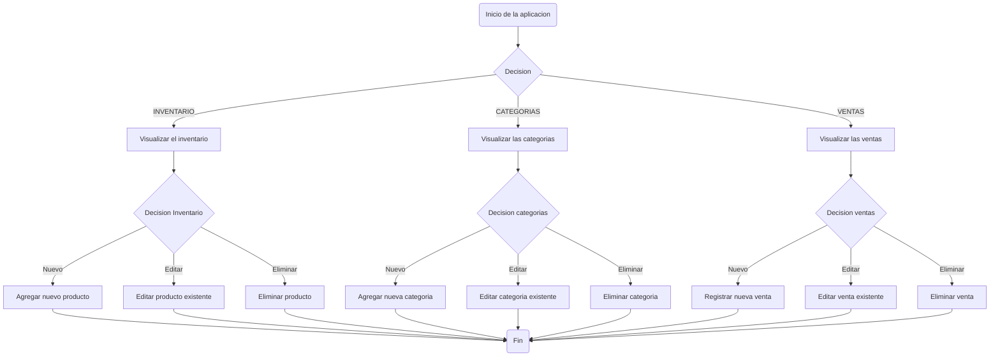

# Requerimientos Inventario

## Tabla de contenido
- [Requerimientos del proyecto](#Requerimientos-del-proyecto)
- [Requerimientos del sistema](#Requerimientos-del-sistema)
- [Diagrama de caso de uso](#Diagrama-de-caso-de-uso)
- [Diagrama de clases con base de datos](#Diagrama-de-clases-con-base-de-datos)
- [Legal](#Legal)

## Requerimientos del proyecto

-	Desarrollar una aplicación de inventario para una tienda que permita llevar un control de los recursos de la tienda.
-	La aplicación debe tener una interfaz que le facilite su uso al usuario y que sea agradable a la vista.
-	La aplicación debe de poseer una base de datos para el registro y control de los productos y ventas.
-	La aplicación debe de permitir el ingreso de nuevos productos.
-	La aplicación debe de permitir el editar los productos existentes.
-	La aplicación debe permitir el eliminar los productos existentes.
-	La aplicación debe de permitir registrar las ventas de los productos.
-	La aplicación debe de permitir eliminar las ventas de los productos.
-	La aplicación debe de permitir editar las ventas de los productos.
-	La aplicación debe de permitir registrar la categoría de los productos.
-	La aplicación debe de permitir eliminar la categoría de los productos.
-	La aplicación debe de permitir editar la categoría de los productos.
-	El uso del lenguaje de Java para el desarrollo de la aplicación.
-	Una interfaz gráfica desarrollada en HTML.
-	El uso de MySQL para el desarrollo de la base de datos.
-	La aplicación desarrollada en Java será de tipo web
-	EL equipo requiere conexión a internet.
-	La interfaz gráfica de la aplicación debe de mostrar información básica de los productos como lo son: el código, nombre, descripción, stock, categoría, entre otros.
-	La aplicación debe de reflejar los datos de la base de datos.
-	Los cambios realizados en la aplicación deben de verse reflejados también en la base de datos.	

## Requerimientos del sistema:

  - Versión de Java 8.0.
  - Motor de base de datos MySQL versión 8.0 o 8.0.23.
  - Conexión a internet.

# Diagrama de caso de uso

  

    
Codigo del diagrama

  

     

## Diagrama de clases con base de datos:

## Legal:

| Copyright 2020 Inventario-ingesoft   |
|---|
|  Licensed under the Apache License, Version 2.0 (the "License"); you may not use this file except in compliance with the License. You may obtain a copy of the License at |
| http://www.apache.org/licenses/LICENSE-2.0   |
| Unless required by applicable law or agreed to in writing, software distributed under the License is distributed on an "AS IS" BASIS, WITHOUT WARRANTIES OR CONDITIONS OF ANY KIND, either express or implied. See the License for the specific language governing permissions and limitations under the License.  |

### Terceras partes:

nuestro producto usa componentes de terceras partes liberados bajo sus propias licencias.

- jquery: MIT (https://github.com/jquery/jquery)
- java: ( https://www.oracle.com/java/technologies/javase-documentation.html)
- Arial: (https://www.fonts.com/font/monotype/arial/licenses#) 
