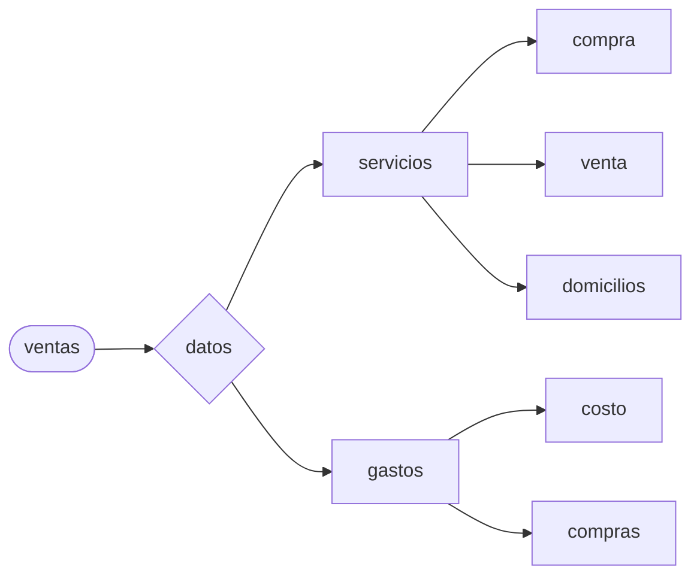

##Diagramas de caso

-usuario
```mermaid
graph LR
a([usuarios]) --> b{ingresar}

b{ingresar} --> c[cliente]
c[cliente] --> e[Comprobar existencias]
e[Comprobar existencias] --> f{Registrar}
f{Registrar} --> h[ventas]

b{ingresar} --> d[administrador]
d[administrador] --> e[Comprobar existencias]
e[Comprobar existencias] --> g{Registrar}

g{Registrar} --> h[ventas]

g{Registrar} --> k{Editar}
k{Editar} --> m[ventas]
k{Editar} --> n[categorias]
k{Editar} --> ñ[productos]

g{Registrar} --> i[categorias]

g{Registrar} --> l{Eliminar}
l{Eliminar} --> o[ventas]
l{Eliminar} --> p[categorias]
l{Eliminar} --> q[productos]

g{Registrar} --> j[productos]
 ```

-productos
```mermaid 
graph LR
a([productos])--> b{ver}
b{ver}-->c[comprar]
b{ver}-->c[nuevo]
b{ver}-->d[editar]
b{ver}-->e[eliminar]


```

-ventas

