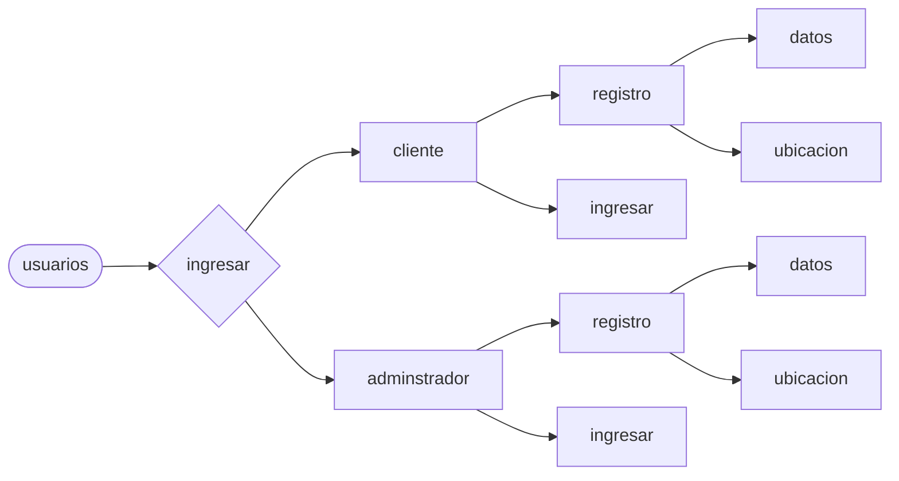
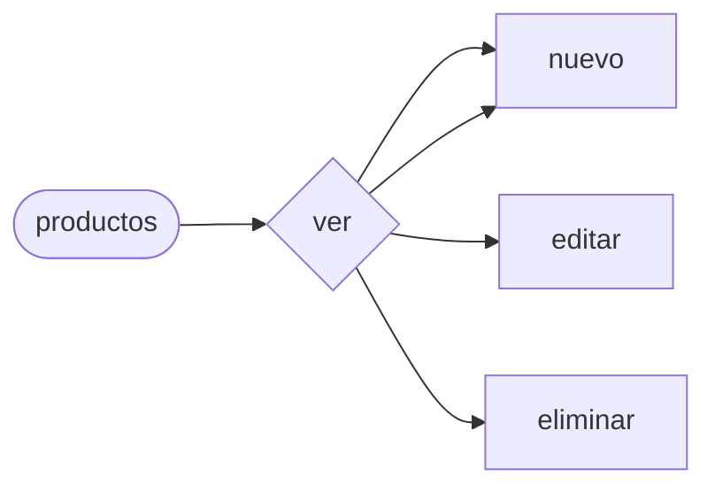

##Diagramas de caso

-usuario

```mermaid 
graph LR
a([usuarios]) --> b{ingresar}
b{ingresar} --> c[cliente]
 c[cliente]-->g[registro]
              g[registro]-->h[datos]
              g[registro]-->i[ubicacion]
 c[cliente]-->j[ingresar]
b{ingresar} -->d[adminstrador]
 d[adminstrador] -->e[registro]
              e[registro]-->k[datos]
              e[registro]-->l[ubicacion]    
 d[adminstrador] -->f[ingresar]
```

-productos

```mermaid 
graph LR
a([productos])--> b{ver}
b{ver}-->c[comprar]
b{ver}-->c[nuevo]
b{ver}-->d[editar]
b{ver}-->e[eliminar]


```

-ventas

```mermaid 
graph LR
a([ventas])--> b{datos}
b{datos}-->c[servicios]
           c[servicios]-->e[compra]
           c[servicios]-->f[venta]
           c[servicios]-->g[domicilios]
b{datos}-->d[gastos]
            d[gastos]-->h[costo]
            d[gastos]-->i[compras]

    

```